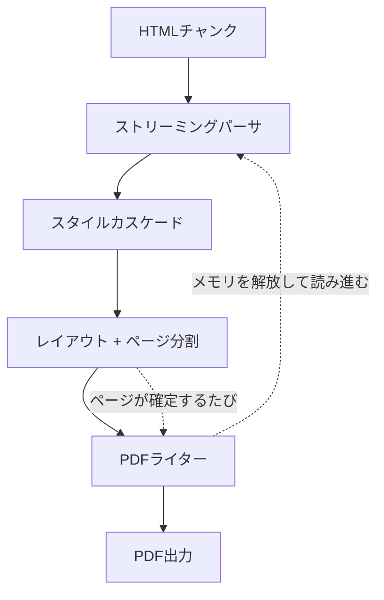

# sghtmltopdf とは

HTML をそのまま PDF として出力するための変換器/レンダラーです。
Rust で書かれており、Chromium/Webkit/Geckoのヘッドレスブラウザのインストールを必要とせず PDF を出力できます。

使い方は、CLI・HTTPサーバ・ライブラリの3種類から選択でき、どれも同じエンジンを同じオプションで動かします。
ライブラリについては、現時点で Rubygems に対応しています。

PDFエンジンは、html5ever/Stylo/Taffy といった Servo が提供している Rust クレートをベースに構築しています。

## wkhtmltopdf/WickedPDF への感謝

作者が初めてWebアプリ上で PDF を出力する機能を実装することになったとき、当時の開発環境は Ruby on Rails だったのですが、[wkhtmltopdf](https://github.com/wkhtmltopdf/wkhtmltopdf) と Railsから使うための [wicked_pdf gem](https://github.com/mileszs/wicked_pdf) を使っていました。  
それまで何となく PDF は難しそうで敬遠していたのですが、HTML で見た目を確認してそのまま PDF に出力できるという快適な開発フローに感動したのを覚えています。

しかし、[wkhtmltopdf](https://github.com/wkhtmltopdf/wkhtmltopdf) は依存していた QtWebkit がメンテナンス終了になったため、それに伴い2023年1月にアーカイブされてしまいました。  
現在は、Headless Chrome等のヘッドレスブラウザを使って PDF を出力する場面が多いと思います。

個人的に、wkhtmltopdf のアプローチがとても好きだったので、wkhtmltopdf をモダナイズしたものを作ろうと思いました。  
sghtmltopdf の「sg」は Second Generation の略で、wkhtmltopdf への敬意を込めて「次世代」をつけました。

## wkhtmltopdf（QtWebkit）やヘッドレスブラウザを使ったPDF出力に感じていた課題

- QtWebkit が古く、CSS3 への対応が限定的（FlexboxやGridやカスタムプロパティに非対応）
- Webfont を使うと、読み込みを待たずに PDF 出力されてしまうことがある
- 表（Table）の最中で改ページした場合、改ページ後のページに表のヘッダーが出せない
- Webアプリとは別にバイナリをインストールする必要があり、AWS Lambda などで環境構築に手間がかかる
- 同時リクエスト数が増えると CPU 消費コストが増えやすい
- 巨大な HTML が渡ってくると、メモリ消費コストが増えやすい

これらを解決するために、sghtmltopdf では以下のような対応を入れました。

- CSS3 にほぼ対応（レアプロパティは一部非対応）
- Webfont に対応。serif/sans-serif/mono それぞれ個別に指定可能に
- 表（Table）の途中で改ページが起きてもヘッダーを表示するように
- ネイティブ拡張を FFI で呼び出すことで、ブラウザを必要とせず、Webアプリのプロセスに同居可能に
- HTML をチャンク単位で読み、確定したページから書き出せるストリーミングモードを用意

## 処理の流れ

ページの区切りが確定した時点でPDFを書き出し、そのページ分のメモリを解放して先へ読み進めることで、大きな文書でも消費メモリを増やさず処理を可能にしています。
