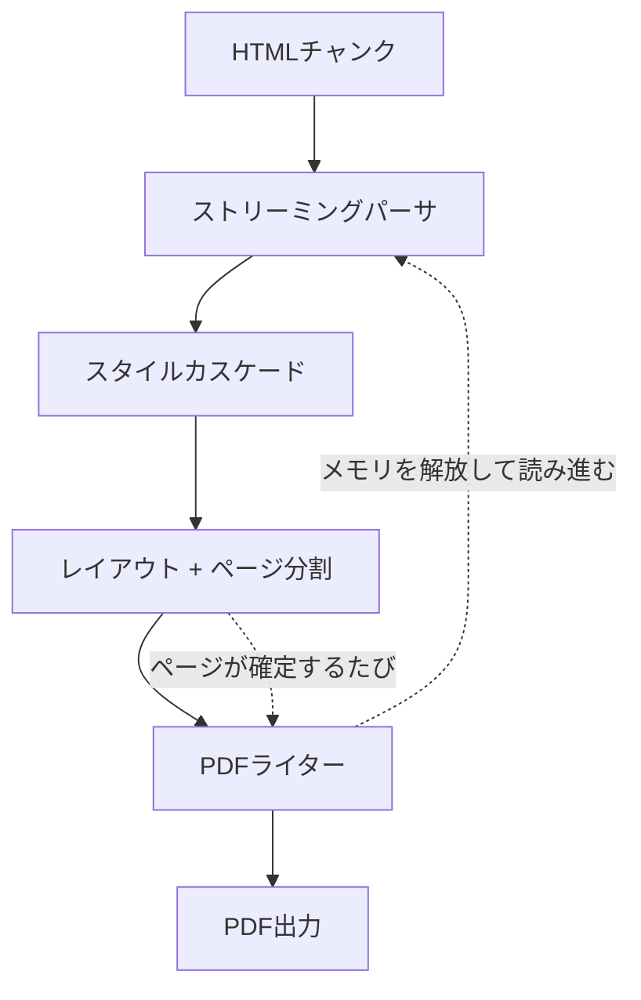

# sghtmltopdf とは

HTML をそのまま PDF として出力するための変換器/レンダラーです。
Rust で書かれており、Chromium/Webkit/Geckoのヘッドレスブラウザのインストールを必要とせず PDF を出力できます。

使い方は、CLI・HTTPサーバ・ライブラリの3種類から選択でき、どれも同じエンジンを同じオプションで動かします。
ライブラリについては、現時点で Rubygems に対応しています。

PDFエンジンは、html5ever/Stylo/Taffy といった Servo が提供している Rust クレートをベースに構築しています。

## wkhtmltopdf/WickedPDF への感謝

作者が初めてWebアプリ上で PDF を出力する機能を実装することになったとき、当時の開発環境は Ruby on Rails だったのですが、[wkhtmltopdf](https://github.com/wkhtmltopdf/wkhtmltopdf) と Railsから使うための [wicked_pdf gem](https://github.com/mileszs/wicked_pdf) を使っていました。  
それまで何となく PDF は難しそうで敬遠していたのですが、HTML で見た目を確認してそのまま PDF に出力できるという快適な開発フローに感動したのを覚えています。

しかし、[wkhtmltopdf](https://github.com/wkhtmltopdf/wkhtmltopdf) は依存していた QtWebkit がメンテナンス終了になったため、それに伴い2023年1月にアーカイブされてしまいました。  
現在は、Headless Chrome等のヘッドレスブラウザを使って PDF を出力する場面が多いと思います。

個人的にwkhtmltopdf のアプローチがとても好きだったので、使っていて感じた課題を解消させてモダナイズした wkhtmltopdf を作ろうと思いました。  
sghtmltopdf の「sg」は Second Generation の略で、wkhtmltopdf への敬意を込めて「次世代」をつけました。

## wkhtmltopdf（QtWebkit）やヘッドレスブラウザを使ったPDF出力に感じていた課題

- QtWebkit が古く、CSS3 への対応が限定的（FlexboxやGridやカスタムプロパティに非対応）
- Webfont を使うと、読み込みを待たずに PDF 出力されてしまうことがある
- 表（Table）の最中で改ページした場合、改ページ後のページに表のヘッダーが出せない
- Webアプリとは別にバイナリをインストールする必要があり、AWS Lambda などで環境構築に手間がかかる
- 巨大な HTML が渡ってくると、出力にかかる時間やメモリ消費コストが一気に増える

これらを解決するために、sghtmltopdf では以下のような対応を入れました。

- CSS3 にほぼ対応（レアプロパティは一部非対応）
- Webfont に対応。serif/sans-serif/mono それぞれ個別に指定可能に
- 表（Table）の途中で改ページが起きてもヘッダーを表示するように
- ネイティブ拡張を FFI で呼び出すことで、ブラウザプロセスの起動を必要とせず、Webアプリのプロセスに同居可能に
- HTML をチャンク単位で読み確定したページから書き出せるストリーミングモードを用意して、メモリ消費量を律速に

### wkhtmltopdf / ヘッドレスChromeとのパフォーマンス比較

同じHTMLを同じ用紙設定で変換したときの実測値です。
用紙設定は「用紙A4・余白10mm」を`@page`で指定し、フォントは`@font-face`で同じファイルを参照しています。

比較対象は、アーカイブ時点の最終版である wkhtmltopdf 0.12.6.1 と、Google Chrome 151 のヘッドレスモードです。
各セルは「ピークメモリ / 処理時間」を表します。

この比較は `cargo run --release --example compare_engines` で出したものです。

段落が主体の文書:

| 要素数 | sghtmltopdf | sghtmltopdf（ストリーミング） | wkhtmltopdf | ヘッドレスChrome |
|---|---|---|---|---|
| 5,000 | 26MB / 0.21秒 | 9MB / 0.21秒 | 43MB / 0.48秒 | 563MB / 1.29秒 |
| 20,000 | 79MB / 0.89秒 | 13MB / 0.88秒 | 86MB / 2.30秒 | 952MB / 7.40秒 |
| 60,000 | 228MB / 3.33秒 | 24MB / 2.80秒 | 200MB / 32.54秒 | 1,649MB / 93.89秒 |

表が主体の帳票:

| 行数 | sghtmltopdf | sghtmltopdf（ストリーミング） | wkhtmltopdf | ヘッドレスChrome |
|---|---|---|---|---|
| 5,000 | 48MB / 0.76秒 | 48MB / 0.84秒 | 62MB / 1.50秒 | 1,369MB / 4.77秒 |
| 20,000 | 171MB / 2.93秒 | 171MB / 3.12秒 | 163MB / 13.53秒 | 6,221MB / 39.19秒 |

処理時間は文書が大きくなるほど差が開きます。
60,000要素では wkhtmltopdf の約10倍、ヘッドレスChromeの約28倍の速さです。
20,000行の帳票では、それぞれ約4.6倍・約13倍になります。

メモリは、wkhtmltopdfとはほぼ同等です。
60,000要素と20,000行の帳票では sghtmltopdf のほうがやや多く、文書サイズに比例して増える点も変わりません。
[ストリーミングモード](usage/cli/streaming.md)を使うと、段落主体の文書では24MBまで下がります。
一方、巨大な表が1つだけの帳票ではストリーミングの効果がありません。
確定したページを書き出す区切りが`<body>`直下の要素単位のため、表が1つしかない文書では表の最後を書き出すまでメモリを解放できないからです。

ヘッドレスChromeとは桁が違い、20,000行の帳票では6.2GBに達します。
ヘッドレスChromeはブラウザとして必要な機能が全て含まれているため、PDF出力に特化した sghtmltopdf の方がメモリ効率が良くなります。

## 処理の流れ

ページの区切りが確定した時点でPDFを書き出し、そのページ分のメモリを解放して先へ読み進めることで、大きな文書でも消費メモリを増やさず処理を可能にしています。
