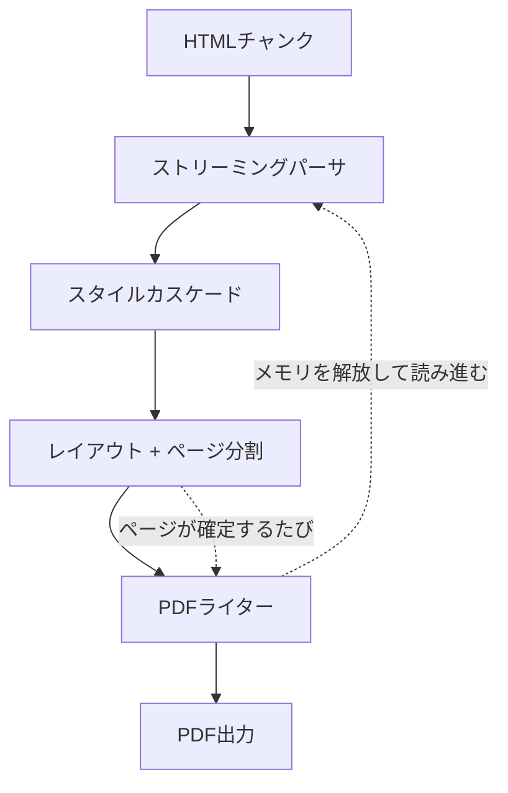

# sghtmltopdf とは

HTML をそのまま PDF として出力するための変換器/レンダラーです。
Rust で書かれており、Chromium/Webkit/Geckoのヘッドレスブラウザのインストールを必要とせず PDF を出力できます。

使い方は、CLI・HTTPサーバ・ライブラリの3種類から選択でき、どれも同じエンジンを同じオプションで動かします。
ライブラリについては、現時点で Rubygems に対応しています。

PDFエンジンは、html5ever/Stylo/Taffy といった Servo が提供している Rust クレートをベースに構築しています。

## wkhtmltopdf/WickedPDF への感謝

作者が初めてWebアプリ上で PDF を出力する機能を実装することになったとき、当時の開発環境は Ruby on Rails だったのですが、[wkhtmltopdf](https://github.com/wkhtmltopdf/wkhtmltopdf) と Railsから使うための [wicked_pdf gem](https://github.com/mileszs/wicked_pdf) を使っていました。  
それまで何となく PDF は難しそうで敬遠していたのですが、HTML で見た目を確認してそのまま PDF に出力できるという快適な開発フローに感動したのを覚えています。

しかし、[wkhtmltopdf](https://github.com/wkhtmltopdf/wkhtmltopdf) は依存していた QtWebkit がメンテナンス終了になったため、それに伴い2023年1月にアーカイブされてしまいました。  
現在は、Headless Chrome等のヘッドレスブラウザを使って PDF を出力する場面が多いと思います。

個人的に、wkhtmltopdf のアプローチがとても好きだったので、wkhtmltopdf をモダナイズしたものを作ろうと思いました。  
sghtmltopdf の「sg」は Second Generation の略で、wkhtmltopdf への敬意を込めて「次世代」をつけました。

## wkhtmltopdf（QtWebkit）やヘッドレスブラウザを使ったPDF出力に感じていた課題

- QtWebkit が古く、CSS3 への対応が限定的（FlexboxやGridやカスタムプロパティに非対応）
- Webfont を使うと、読み込みを待たずに PDF 出力されてしまうことがある
- 表（Table）の最中で改ページした場合、改ページ後のページに表のヘッダーが出せない
- Webアプリとは別にバイナリをインストールする必要があり、AWS Lambda などで環境構築に手間がかかる
- 巨大な HTML が渡ってくると、出力にかかる時間やメモリ消費コストが一気に増える

これらを解決するために、sghtmltopdf では以下のような対応を入れました。

- CSS3 にほぼ対応（レアプロパティは一部非対応）
- Webfont に対応。serif/sans-serif/mono それぞれ個別に指定可能に
- 表（Table）の途中で改ページが起きてもヘッダーを表示するように
- ネイティブ拡張を FFI で呼び出すことで、ブラウザプロセスの起動を必要とせず、Webアプリのプロセスに同居可能に
- HTML をチャンク単位で読み確定したページから書き出せるストリーミングモードを用意して、メモリ消費量を律速に

### wkhtmltopdfとのパフォーマンス比較

同じHTMLを同じ用紙設定で変換したときの実測値です。
用紙設定は「用紙A4・余白10mm」、フォントは `@font-face` で同じファイルを参照。wkhtmltopdfには`--disable-javascript`を指定しています。

計測に使っている wkhtmltopdf はアーカイブの最終版である v0.12.6.1 を使っています。
各セルは「ピークメモリ / 処理時間」を表します。

段落が主体の文書:

| 要素数 | wkhtmltopdf | sghtmltopdf | sghtmltopdf（ストリーミング） |
|---|---|---|---|
| 5,000 | 50MB / 0.5秒 | 28MB / 0.2秒 | 11MB / 0.2秒 |
| 20,000 | 92MB / 2.1秒 | 83MB / 0.9秒 | 16MB / 0.8秒 |
| 60,000 | 206MB / 25.3秒 | 233MB / 3.3秒 | 26MB / 3.0秒 |

表が主体の帳票:

| 行数 | wkhtmltopdf | sghtmltopdf | sghtmltopdf（ストリーミング） |
|---|---|---|---|
| 5,000 | 72MB / 1.6秒 | 50MB / 0.8秒 | 50MB / 0.9秒 |
| 20,000 | 182MB / 12.8秒 | 175MB / 2.8秒 | 175MB / 2.8秒 |

処理時間は文書が大きくなるほど差が開き、60,000要素で約7.7倍、20,000行の帳票で約4.6倍の差になります。

メモリは、通常モードでは同程度です。
60,000要素では通常モードのほうが多く使っており（233MB 対 206MB）、文書サイズに比例して増える点はwkhtmltopdfと変わりません。
[ストリーミングモード](usage/cli/streaming.md)を使うと、ここが26MBまで下がります。
一方、巨大な表が1つだけの帳票ではストリーミングの効果がありません。
確定したページを書き出す区切りが`<body>`直下の要素単位のため、表が1つしかない文書では表の最後を書き出すまでメモリを解放できないからです。

## 処理の流れ

ページの区切りが確定した時点でPDFを書き出し、そのページ分のメモリを解放して先へ読み進めることで、大きな文書でも消費メモリを増やさず処理を可能にしています。
