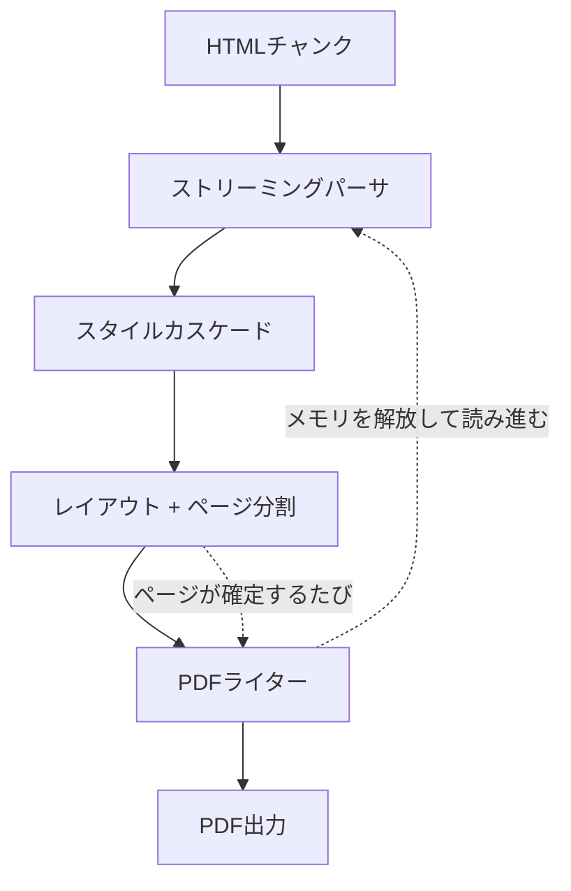

# sghtmltopdfとは

**Chromium/WebKit/Geckoに依存しない、HTMLからPDFを作るためのレンダラー**です。
Rustで書かれており、ブラウザのプロセスを起動しません。

請求書・納品書・レポートといった、**上から下へ流れて明示的な区切りがある文書**を
PDFにすることに目的を絞っています。

```sh
sghtmltopdf invoice.html -o invoice.pdf
```

CLI・HTTPサーバ・Ruby(Rails)の3つの入口があり、どれも同じエンジンを同じ
オプションで動かします。

## なぜ作っているか

[wkhtmltopdf](https://github.com/wkhtmltopdf/wkhtmltopdf)は2023年1月に
アーカイブされ、最終リリースは2020年、未修正の脆弱性(CVE-2022-35583)を
抱えたままになっています。その後継として広く使われているheadless Chrome方式
(Puppeteer/Playwright)には、帳票を大量に出す用途で次の困りごとがあります。

| 困りごと | sghtmltopdfでは |
|---|---|
| Chromeプロセスが重く、並べるとCPUが飽和する | ブラウザを起動しない。1プロセスの中で変換する |
| webfontの読み込みを待たずにPDF化されることがある | フォントの解決はレンダリングの一部で、待ち合わせの概念が無い |
| 大きなHTMLは全体をメモリに載せる必要がある | チャンク単位で読み、確定したページから書き出せる([ストリーミングモード](cli/streaming.md)) |
| ブラウザのバイナリを置けない環境で使えない | 単一の実行ファイル。ネイティブ拡張としてRubyプロセスに同居もできる |

名前の`sg`は **Second Generation** の略で、WebKitベースだったwkhtmltopdfへの
敬意を込めた「第2章」を表しています。

> **Note**
> html5ever・Stylo・Taffy・KrillaといったServo/Rustエコシステム由来のクレートを
> 使っていますが、Servo公式プロジェクトとは無関係の独立した実装です。

## 処理の流れ



ページの区切りが確定した時点でPDFを書き出し、そのページ分のメモリを手放して
先へ読み進みます。これが「大きな文書でもメモリが増えない」の中身です。

## 何ができないか

期待と違うものを掴まないよう、先に書いておきます。

* **JavaScriptを実行しません**。`<script>`は読み飛ばされます。ページ番号のような
  動的な値は、JSではなく[ヘッダー/フッターのプレースホルダ](cli/reference.md#ヘッダーフッター)や
  CSSのカウンタで表現します
* **ブラウザとpixel-perfectな一致はしません**。一般のWebページをそのまま
  綺麗に出すことは目標にしていません
* **CSSは全部には対応していません**。対応状況は
  [プロパティ対応表](css/properties.md)と[セレクタ・値・at-rule](css/selectors.md)に
  実装から起こした一覧があります

より詳しくは[対応していないこと](appendix/limitations.md)を参照してください。

## 次に読むもの

* [インストール](getting-started/install.md)
* [はじめてのPDF](getting-started/first-pdf.md)
* wkhtmltopdfを使っている場合は[wkhtmltopdfからの移行](migration/wkhtmltopdf.md)
* wicked_pdf(Rails)を使っている場合は[wicked_pdfからの移行](migration/wicked-pdf.md)
