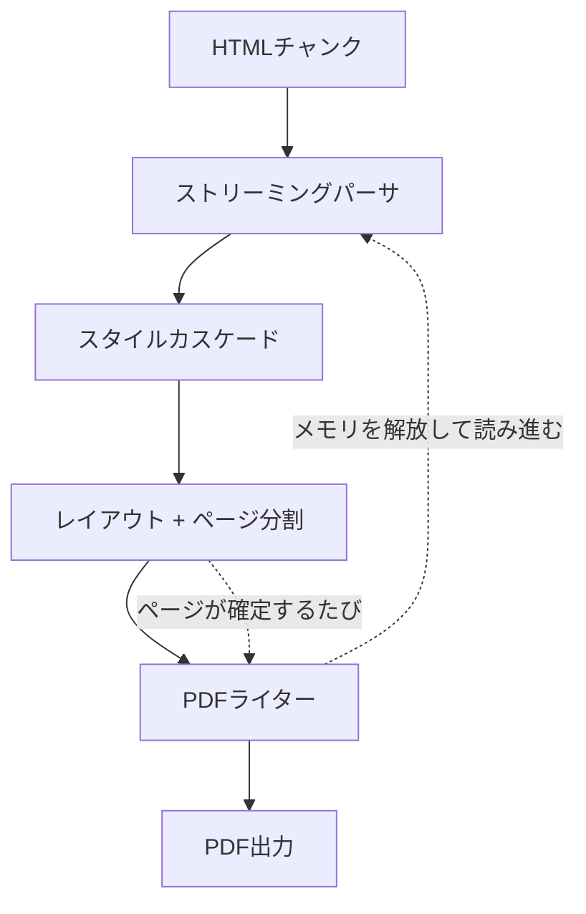

# ストリーミングモード

`--streaming`を付けると、HTMLをチャンク単位で読みながら、ページが確定したそばからPDFを書き出して、そのページ分のメモリを手放します。

```sh
sghtmltopdf big.html -o big.pdf --streaming
```

数万要素規模のHTMLで効果があります([メモリと処理時間](#メモリと処理時間))。
その代わり、文書全体を見ないと決まらないものが使えなくなります。

## 使えないもの(エラーになる)

指定するとexit code 3で終了します。

| 使えないもの | 理由 |
|---|---|
| `counter(pages)` / ヘッダー・フッターの`[topage]` | 総ページ数は1パスでは決まらない |
| `--toc` | 同上(目次には本文のページ番号が要る) |
| `<html>`/`<body>`自身の背景色・枠線 | 複数ページにまたがる装飾の再現が必要になる |
| `<body>`より後の`<style>` / `<link rel="stylesheet">` | 既に書き出したページへ遡って適用できない |

## 警告のうえ続行するもの

結果が変わるため、黙って進めずに警告を出します。

| 制約 | 挙動 |
|---|---|
| `font-family`名からのシステムフォント自動探索 | 既定のフォントで描画する。`--font`/`--gothic-font`/`--serif-font`/`--mono-font`か`@font-face`で明示すれば解決できる |
| 文字を描画できるフォントのシステム探索 | 文書全体を先読みできないため行わない。フォントを1つも指定しなかった場合だけ、CJK用のフォントを1本先回りで読み込む([フォント](../../supports/fonts.md#ストリーミングモードでの注意))。描画できない文字が出たら文字ごとに警告する |
| `:last-of-type`・`:only-of-type`・`:nth-last-child()`・`:nth-last-of-type()`・`:has(~ ...)` | 結果が変わる(余分にマッチする、または取りこぼす) |

`<body>`直下の要素は、次の兄弟が現れた時点でスタイルを確定させます。
そのため「この先に同じ型の要素が続くか」を要求するセレクタだけが判定できません。
「最後の要素だけ罫線を消す」といった指定は、クラスを振って`.last { … }`のように書き換えてください。

これ以外の兄弟セレクタ(`+`・`~`・`:first-child`・`:nth-child()`・`:last-child`など)はバッチと同じ結果になります。
詳細は[セレクタ](../../supports/selectors.md#ストリーミングモード固有の制約)を参照してください。

## 使えるもの

以下はストリーミングモードでも通常どおり使えます。

* `--cover`(表紙)
* ヘッダー/フッター(`[page]`まで。`[topage]`は不可)
* ページ設定・PDFメタデータ
* `--grayscale` / `--dpi` / `--zoom`
* コンテンツ挙動のオプション(`--no-images`等)
* `break-before`/`break-after`/`break-inside`・`orphans`/`widows`などの[ページ分割](../../supports/pagination.md)

## メモリと処理時間

同じHTMLを両モードで変換した実測値です。
各セルは「ピークメモリ / 処理時間」を表します。

| 要素数 | HTMLサイズ | 通常モード | `--streaming` |
|---|---|---|---|
| 1,000 | 46KB | 11MB / 0.02秒 | 8MB / 0.02秒 |
| 5,000 | 233KB | 26MB / 0.08秒 | 10MB / 0.10秒 |
| 20,000 | 946KB | 81MB / 0.35秒 | 15MB / 0.38秒 |
| 60,000 | 2.8MB | 228MB / 1.05秒 | 28MB / 1.07秒 |

通常モードのピークメモリは文書サイズにほぼ比例して増えますが、`--streaming`ではほとんど増えません。
60,000要素では約8分の1になります。
`--streaming`でもわずかに増えるのは、PDFの相互参照表(全オブジェクトの位置)と使用グリフの集計を最後まで保持するためです。

処理時間は両モードでほぼ変わりません。
`--streaming`のほうがわずかに遅く出ますが、差はどの規模でも0.03秒以内で、文書が大きくなるほど相対差は縮まります(60,000要素では2%)。
メモリを大きく減らす代わりに時間を損なう、という関係にはなっていません。

測定条件は次のとおりです。

* sghtmltopdf 0.1.0のreleaseビルド、Intel Core Ultra 7 258V / メモリ16GB / WSL2(Linux 5.15)
* 高さ60pxの`<p>`を要素数ぶん並べただけのHTML。フォントは`--font`で明示
* ピークメモリはプロセスの最大常駐セットサイズ(RSS)。2回実行して良いほうの値

## いつ使うか

* 数千ページ規模の帳票を1本のHTMLから出す
* メモリの上限が厳しい環境(コンテナのメモリ制限、サーバレス)で動かす

逆に、数十ページの請求書のような文書では通常モードで十分です。
制約を負ってまで使うものではありません。

[サーバモード](../server.md)では、クエリに`streaming`を付けると同じモードになります。
`?stream=1`(chunkedで返す)と組み合わせると、入力・レンダリング・出力のすべてが逐次処理になります。

```sh
curl --data-binary @big.html 'http://127.0.0.1:8080/pdf?stream=1&streaming' -o out.pdf
```

## ストリーミング時の処理の流れ



ページの区切りが確定した時点でPDFを書き出し、そのページ分のメモリを解放して先へ読み進めることで、大きな文書でも消費メモリを増やさず処理を可能にしています。
